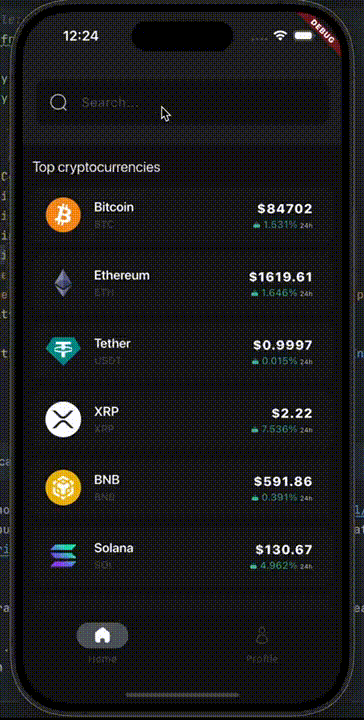

# Crypto app

> App to browse the top cryptocurrencies by market cap

## Demo

Find the MP4 in `demo/`

 

## Features

- **Fetch data from CoinGecko**  
    - Retrieves up-to-date cryptocurrency information

- **List of Top 10 Cryptocurrencies**  
    - Shows a list of the top cryptocurrencies by market cap

- **Essential Crypto Details**
    - Name
    - Symbol
    - Current price in USD
    - 24-hour price change percentage

- **Theme Switching**
    - Dark and Light modes
    - Stored preference between sessions

- **Local Search Functionality**
    - Search within the top 10 cryptocurrencies (locally)

- **Two Screens**
    - **Home Screen:** Displays the list of cryptocurrencies and the search field
    - **Profile Screen:** Allows theme switching

## How to run the app?

1. Locate the `env_public` file in the root of the project. Rename it to `.env`
2. Add your API key from the platform https://api.coingecko.com/:
```
CRYPTO_API_KEY=""
CRYPTO_BASE_URL="api.coingecko.com
```
3. Figure out the flutter version
    - **Option 1:**
        1. Install fvm https://pub.dev/packages/fvm
        2. Run the command (the current version can be found in the `.fvmrc` file)
        ```bash
        fvm use 3.27.4 
        ```

    - **Option 2:**
        1. Make sure that the flutter version on your computer is compatible with the project
        2. Open the `tool/run.sh` file and remove **fvm** from there, like this:
    
        ```bash
        cd ../
        source .env
        export $(cut -d= -f1 .env)
        
        flutter run \
        --dart-define=CRYPTO_API_KEY="$CRYPTO_API_KEY" \
        --dart-define=CRYPTO_BASE_URL="$CRYPTO_BASE_URL"
        ```
   
4. Run `tool/run.sh` 